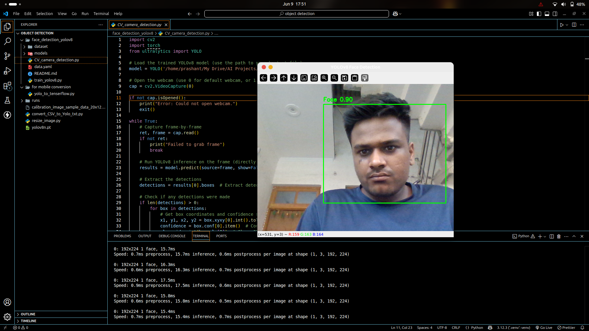
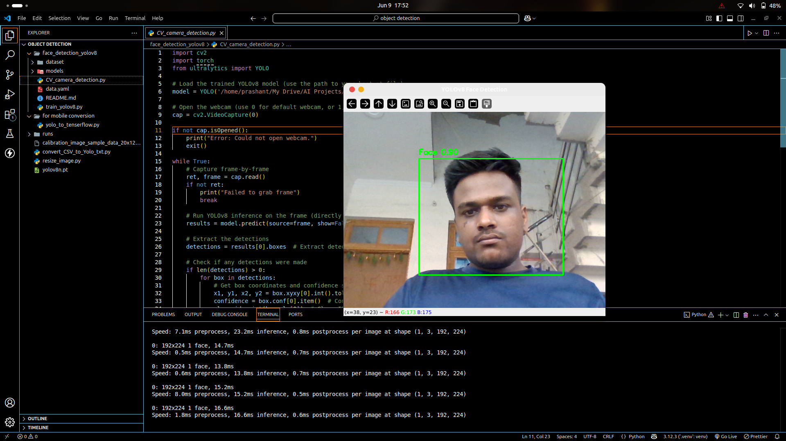

# Real-Time Face Detection using YOLOv8

A deep learning-based face detection project using a custom-trained YOLOv8 model. This project captures real-time video from a webcam, detects faces, and displays the bounding boxes around them.

---

## 📌 Features

- Real-time face detection using a webcam
- Custom trained YOLOv8 model on a self-collected dataset
- Converted to TensorFlow Lite for mobile deployment
- High accuracy with optimized model size
- Live visualization with bounding boxes using OpenCV

---

## 📷 Demo

### 🔍 Face Detection Example


### 🎥 Real-Time Detection Snapshot


---

## 🛠️ Technologies Used

- **YOLOv8** - Ultralytics
- **Python** - for scripting
- **OpenCV** - for image/video processing
- **TensorFlow Lite** - for optimized deployment
- **Labeling Tools** - like CVAT for data annotation

---

## 🧠 Model Training

- Annotated dataset with bounding boxes for faces
- Trained using YOLOv8 (`yolov8n.yaml`) with 50+ epochs
- Achieved:
  - **mAP50**: 0.866
  - **mAP50-95**: 0.527

---

## 🚀 Run Locally

### 1. Clone the repo
```bash
git clone https://github.com/your-username/yolov8-face-detection.git
cd yolov8-face-detection
```
---

## 📬 Contact

Feel free to reach out if you have any questions or feedback:

[](https://www.linkedin.com/in/prashant-maurya-017776246/)
